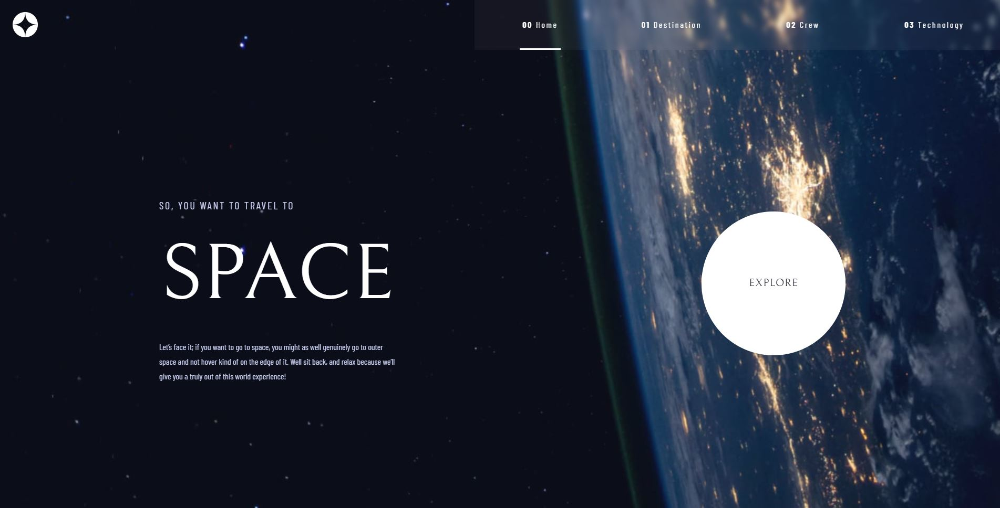

# Frontend Mentor - Space tourism website solution
## Table of contents

- [Overview](#overview)
  - [The challenge](#the-challenge)
  - [Screenshot](#screenshot)
  - [Links](#links)
- [My process](#my-process)
  - [Built with](#built-with)
  - [What I learned](#what-i-learned)
  - [Continued development](#continued-development)
- [Author](#author)

## Overview

### The challenge

Users should be able to:

- View the optimal layout for each of the website's pages depending on their device's screen size
- See hover states for all interactive elements on the page
- View each page and be able to toggle between the tabs to see new information

### Screenshot

### Links

- Solution URL: [https://github.com/CMikeZeltner/FEMentor-space-tourism-site]
- Live Site URL: [Add live site URL here](https://your-live-site-url.com)

## My process

### Built with

- Flexbox
- CSS Grid
- Mobile-first workflow
- [React](https://reactjs.org/) - JS library
- [Styled Components](https://styled-components.com/) - For styles

### What I learned

Use this section to recap over some of your major learnings while working through this project. Writing these out and providing code samples of areas you want to highlight is a great way to reinforce your own knowledge.

I think my biggest takeaway from this project is that styled components are a lot better for React than a plain CSS file. In addition I got to use the "row/column-reverse" options for flex-direction, which is a style I never really could understand the practical use of. I also got to make use of the grid, which was pretty exciting. While I could definitely understand the use of grid, I never really felt like I had a need to use it.

### Continued development

In the future, I'd like to either learn more about how React works, or find another framework I can have better success with. Using React sometimes feels like stepping on a rake with every step you take. For instance, it took me about 5 hours of googling and trying to get React to accept my dynamic link in my Picture components. It turns out it just doesn't work that way. Instead, I had to use template literals to construct the image path string with the name property instead of being able to just use the image string. Very strange, very frustrating, but there is seemingly no other workaround (in create-react-app).

I would also like to continue getting better with CSS, especially in regards to responsive design. I feel like I have a decent hang on designing for mobile and desktop, but tablets tend to trip me up. In the future I'd like to provide a better experience for those in-between screen sizes.

## Author
- Frontend Mentor - [@CMikeZeltner](https://www.frontendmentor.io/profile/CMikeZeltner)

